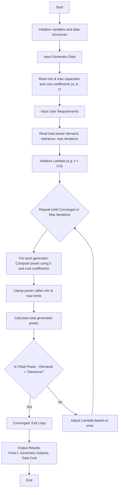

 
# Economic Load Dispatch main doc

### Algorithm

1. **Start**  
   Initialize all required variables and data structures.

2. **Input Generator Data**  
   - For each generator:
     - Read min & max capacities
     - Read cost coefficients: a, b, c

3. **Input User Requirements**  
   - Read total power demand  
   - Set tolerance for acceptable error  
   - Set maximum number of iterations

4. **Initialize Lambda**  
   Set an initial value for lambda (e.g. 0.0)

5. **Repeat Until Convergence or Max Iteration**  
   For each iteration:
   - For each generator:
     - Compute power using lambda and cost coefficients
     - Clamp power within [min_capacity, max_capacity]
   - Calculate total generated power
   - Check if $|total_power - demand| < tolerance$:
     - If yes, exit loop (converged)
     - Else, adjust lambda based on error

6. **Output Results**  
   - Final lambda value  
   - Power output for each generator  
   - Total cost (optional)

7. **End**

### Flowchart

